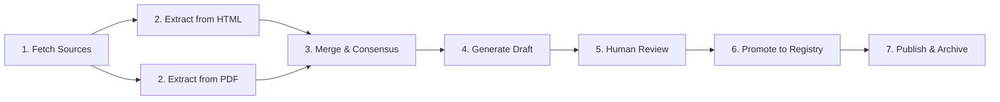

# LLMRing Registry Implementation Roadmap

## Executive Summary

The LLMRing Registry has been enhanced with comprehensive new schema fields as requested in `REGISTRY_UPDATE_REQUEST.md`. However, the implementation is incomplete - critical workflow components are missing, and the dual-source extraction strategy (HTML + PDF) is not properly integrated. This document outlines the current state, target architecture, and implementation steps required for a production-ready registry update system.

## Current State Analysis

### ✅ What's Implemented and Working

1. **Schema Enhancement (Complete)**
   - All 17 new fields added to `ModelInfo` dataclass in `pdf_parser.py`
   - LLM extraction prompts updated in `extract_with_llm.py` to capture new fields
   - Validation logic enhanced in `__main__.py` for all new field types
   - Schema version correctly updated to "3.0"

2. **Working Commands**
   - `fetch-html` - Downloads HTML pricing pages (limited by JavaScript rendering)
   - `fetch` - Downloads PDFs using Playwright (fixed in latest update)
   - `extract` (aka `extract-llm`) - LLM-based extraction from HTML only
   - `validate` - Validates JSON structure with new field support
   - `manifest` - Generates manifest with schema version
   - `list` - Lists models with pricing
   - `sources` - Shows documentation URLs

3. **Extraction Capabilities**
   - LLM successfully extracts and populates all new fields
   - Intelligent defaults based on provider and model characteristics
   - Validation catches type and constraint violations

### ❌ What's Missing or Broken

1. **Critical Missing Commands**
   ```
   extract-comprehensive  # Mentioned in README, not implemented
   extract-html          # Mentioned in README, not implemented
   review-draft          # Required for manual curation, not implemented
   promote               # Required for publishing, not implemented
   export                # For markdown/JSON export, not implemented
   ```

2. **Dual-Source Extraction Not Integrated**
   - PDF extraction (`pdf_parser.py`) exists but is never called
   - No mechanism to combine HTML and PDF extraction results
   - No confidence scoring or consensus building between sources
   - The `ModelInfo` class with new fields is only in PDF path, not used

3. **Workflow Gaps**
   - No draft generation combining both sources
   - No review mechanism for human validation
   - No versioning/archiving system for promoted models
   - No way to handle extraction conflicts between sources

## Target Architecture

### Ideal Workflow



### Detailed Process Flow

1. **Source Collection**
   ```bash
   # Automatically fetch both HTML and PDFs
   uv run llmring-registry fetch-all --provider openai
   # Creates: html_cache/2025-09-14-openai-*.html
   #          pdfs/2025-09-14-openai-*.pdf
   ```

2. **Dual Extraction**
   ```bash
   # Comprehensive extraction from both sources
   uv run llmring-registry extract-comprehensive --provider openai
   # Runs both HTML and PDF extraction
   # Merges results with confidence scoring
   # Creates: drafts/openai.2025-09-14.draft.json
   ```

3. **Review Process**
   ```bash
   # Review draft with diff against current
   uv run llmring-registry review-draft --provider openai --draft drafts/openai.2025-09-14.draft.json
   # Shows changes, conflicts, new models
   # Creates: drafts/openai.2025-09-14.diff.json

   # Accept changes after review
   uv run llmring-registry review-draft --provider openai --draft drafts/openai.2025-09-14.draft.json --accept-all
   # Creates: drafts/openai.reviewed.json
   ```

4. **Promotion & Publishing**
   ```bash
   # Promote reviewed draft to production
   uv run llmring-registry promote --provider openai --reviewed drafts/openai.reviewed.json
   # Updates: models/openai.json
   # Archives: pages/openai/v/4/models.json
   # Updates manifest with new version
   ```

## Implementation Requirements

### Phase 1: Core Infrastructure (Priority: CRITICAL)

#### 1.1 Implement `extract-comprehensive` Command

**File**: `src/registry/extract_comprehensive.py` (NEW)

```python
async def extract_comprehensive(provider: str, html_dir: Path, pdf_dir: Path) -> Dict:
    """
    Extract models from both HTML and PDF sources, merge with confidence scoring.

    Returns:
        Merged model data with confidence levels for each field
    """
    # 1. Extract from HTML using existing extract_with_llm
    html_models = await extract_models_from_html(provider, html_content)

    # 2. Extract from PDF using pdf_parser
    pdf_models = parser.parse_provider_docs(provider, pdf_paths)

    # 3. Merge with consensus logic
    merged = merge_with_consensus(html_models, pdf_models)

    # 4. Add metadata
    return {
        "provider": provider,
        "extraction_date": datetime.now().isoformat(),
        "sources": {"html": len(html_models), "pdf": len(pdf_models)},
        "models": merged,
        "confidence_summary": calculate_confidence(merged)
    }
```

**Consensus Algorithm**:
- Match models by `model_name`
- For each field:
  - If both sources agree → confidence: "certain"
  - If only one source has data → confidence: "probable"
  - If sources conflict → confidence: "uncertain", keep both values
- Priority: PDF > HTML for detailed specs, HTML > PDF for current pricing

#### 1.2 Implement Draft Review System

**File**: `src/registry/review.py` (NEW)

```python
@click.command()
@click.option("--provider", required=True)
@click.option("--draft", required=True, type=click.Path(exists=True))
@click.option("--accept-all", is_flag=True)
def review_draft(provider, draft, accept_all):
    """
    Review draft changes against current registry.

    Generates diff report showing:
    - New models added
    - Models removed
    - Field changes with old/new values
    - Confidence levels for uncertain fields
    """
    current = load_current_models(provider)
    draft_data = load_draft(draft)

    diff = generate_diff(current, draft_data)

    if not accept_all:
        # Save diff for manual review
        save_diff_report(diff, draft + ".diff.json")
        show_summary(diff)
    else:
        # Create reviewed file ready for promotion
        reviewed = apply_diff(current, diff)
        save_reviewed(reviewed, f"{provider}.reviewed.json")
```

#### 1.3 Implement Promotion System

**File**: `src/registry/promote.py` (NEW)

```python
@click.command()
@click.option("--provider", required=True)
@click.option("--reviewed", required=True, type=click.Path(exists=True))
def promote(provider, reviewed):
    """
    Promote reviewed models to production.

    Steps:
    1. Validate reviewed data
    2. Increment version number
    3. Archive current version
    4. Update production file
    5. Update manifest
    6. Generate content hash for integrity
    """
    reviewed_data = load_reviewed(reviewed)

    # Validate all required fields
    validate_for_production(reviewed_data)

    # Version management
    current_version = get_current_version(provider)
    new_version = current_version + 1

    # Archive current
    archive_path = f"pages/{provider}/v/{current_version}/models.json"
    archive_current(provider, archive_path)

    # Update production
    reviewed_data["version"] = new_version
    reviewed_data["updated_at"] = datetime.now().isoformat()
    reviewed_data["content_sha256_jcs"] = calculate_hash(reviewed_data)

    save_production(provider, reviewed_data)
    update_manifest(provider, new_version)
```

### Phase 2: Enhanced Extraction (Priority: HIGH)

#### 2.1 Fix PDF Extraction Integration

**Issue**: The `ModelInfo` class with new fields is defined but never used in extraction flow.

**Solution**: Update `pdf_parser.py` to properly construct `ModelInfo` objects with all new fields:

```python
def _parse_model_from_response(self, response: str) -> List[ModelInfo]:
    """Parse LLM response into ModelInfo objects with all fields."""
    models = []
    data = json.loads(response)

    for model_data in data:
        model = ModelInfo(
            model_id=model_data.get("model_name"),
            display_name=model_data.get("display_name"),
            # ... existing fields ...

            # New fields with defaults
            supports_streaming=model_data.get("supports_streaming", True),
            supports_audio=model_data.get("supports_audio", False),
            supports_documents=model_data.get("supports_documents", False),
            context_window_tokens=model_data.get("context_window_tokens"),
            supports_json_schema=model_data.get("supports_json_schema", False),
            supports_logprobs=model_data.get("supports_logprobs", False),
            supports_multiple_responses=model_data.get("supports_multiple_responses", False),
            supports_caching=model_data.get("supports_caching", False),
            is_reasoning_model=model_data.get("is_reasoning_model", False),
            speed_tier=model_data.get("speed_tier"),
            intelligence_tier=model_data.get("intelligence_tier"),
            requires_tier=model_data.get("requires_tier"),
            requires_waitlist=model_data.get("requires_waitlist", False),
            model_family=model_data.get("model_family"),
            recommended_use_cases=model_data.get("recommended_use_cases"),
            is_active=model_data.get("is_active", True),
            added_date=model_data.get("added_date")
        )
        models.append(model)

    return models
```

#### 2.2 Implement Confidence Scoring

**File**: `src/registry/confidence.py` (NEW)

```python
def calculate_field_confidence(html_value, pdf_value, field_name: str) -> Dict:
    """
    Calculate confidence for a field based on source agreement.

    Returns:
        {
            "value": final_value,
            "confidence": "certain" | "probable" | "uncertain",
            "sources": {"html": html_value, "pdf": pdf_value},
            "conflict": bool
        }
    """
    if html_value == pdf_value:
        return {
            "value": html_value,
            "confidence": "certain",
            "sources": {"html": html_value, "pdf": pdf_value},
            "conflict": False
        }

    # Field-specific priority rules
    if field_name in ["dollars_per_million_tokens_input", "dollars_per_million_tokens_output"]:
        # Prefer HTML for pricing (more current)
        value = html_value if html_value is not None else pdf_value
    elif field_name in ["max_input_tokens", "max_output_tokens", "supports_vision"]:
        # Prefer PDF for technical specs (more detailed)
        value = pdf_value if pdf_value is not None else html_value
    else:
        # Default: prefer non-null value
        value = html_value if html_value is not None else pdf_value

    return {
        "value": value,
        "confidence": "probable" if one_is_null else "uncertain",
        "sources": {"html": html_value, "pdf": pdf_value},
        "conflict": both_non_null_but_different
    }
```

### Phase 3: Workflow Commands (Priority: MEDIUM)

#### 3.1 Implement `fetch-all` Command

Combines HTML and PDF fetching in one step:

```python
@cli.command(name="fetch-all")
@click.option("--provider", default="all")
def fetch_all(provider):
    """Fetch both HTML and PDFs for comprehensive extraction."""
    ctx = click.get_current_context()

    # Fetch HTML
    ctx.invoke(fetch_html, provider=provider, output_dir="html_cache")

    # Fetch PDFs if Playwright available
    try:
        ctx.invoke(fetch, provider=provider, output_dir="pdfs")
    except ImportError:
        click.echo("⚠️ Playwright not available, skipping PDF fetch")
```

#### 3.2 Implement `export` Command

```python
@cli.command()
@click.option("--output", type=click.Choice(["markdown", "json", "csv"]))
@click.option("--include-new-fields", is_flag=True, default=True)
def export(output, include_new_fields):
    """Export registry data in various formats."""
    # Implementation for different export formats
    pass
```

### Phase 4: Testing & Validation (Priority: HIGH)

1. **Unit Tests for New Components**
   - Test consensus merging logic
   - Test confidence scoring
   - Test field validation for new fields
   - Test version management

2. **Integration Tests**
   - End-to-end extraction workflow
   - Draft review process
   - Promotion and archiving

3. **Data Validation**
   - Ensure all new fields have appropriate defaults
   - Validate enum field values
   - Check date format consistency
   - Verify context_window_tokens calculation

## Migration Strategy

### Step 1: Complete Core Implementation (Week 1)
- Implement `extract-comprehensive` command
- Implement `review-draft` command
- Implement `promote` command
- Fix PDF extraction integration

### Step 2: Testing & Refinement (Week 2)
- Add comprehensive tests
- Run extraction on all providers
- Review and refine consensus logic
- Document edge cases

### Step 3: Initial Migration (Week 3)
- Extract all providers with new system
- Review drafts for accuracy
- Promote to production
- Update GitHub Pages

### Step 4: Automation (Week 4)
- Update GitHub Actions workflow
- Add monitoring and alerts
- Document operational procedures
- Train team on new workflow

## Risk Mitigation

1. **Data Quality Risks**
   - Implement strict validation before promotion
   - Keep confidence scores visible during review
   - Maintain version history for rollback

2. **Extraction Accuracy**
   - Use both HTML and PDF sources
   - Implement consensus algorithm
   - Require human review for uncertain fields

3. **Breaking Changes**
   - Maintain backward compatibility with schema 2.0
   - Version all changes properly
   - Test with downstream consumers

## Success Criteria

1. ✅ All commands from README are implemented and working
2. ✅ Dual-source extraction produces accurate results
3. ✅ New fields are populated with appropriate values
4. ✅ Human review workflow is smooth and efficient
5. ✅ Version management and archiving work correctly
6. ✅ All tests pass with >90% coverage
7. ✅ Documentation is complete and accurate

## Conclusion

The registry enhancement is partially complete with all schema changes in place, but critical workflow components are missing. The implementation requires approximately 2-4 weeks of focused development to reach production readiness. The priority should be on implementing the comprehensive extraction system and review workflow, as these are essential for maintaining data quality and accuracy in the registry.

The enhanced registry will provide significantly better model selection capabilities for LLMRing users, with comprehensive metadata about capabilities, performance characteristics, and requirements. The dual-source extraction approach will ensure accuracy while the review system maintains quality control.